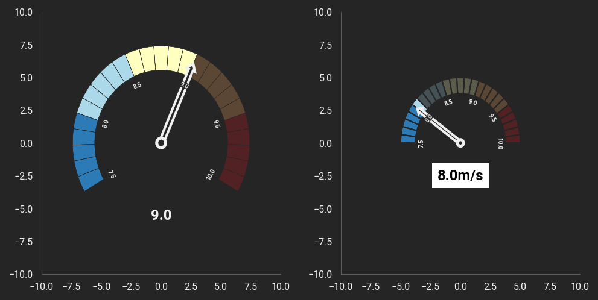

A class to plot speedometer (and gauge) plots


### Installation
```
# 1) Download the package
cd speedo # or the path you saved it to
pip install .
```

if you only download
change "from speedo.speedometer import Speedometer"
to "speedo.speedo.speedometer import Speedometer" below.


```
### Example

import matplotlib.pyplot as plt
%config InlineBackend.figure_format = "retina"
%matplotlib inline

from speedo.speedometer import Speedometer
import themepy

theme = themepy.Theme('dark')
plt.rcParams['axes.grid'] = False
            
fig, ax = plt.subplots(1, 3, figsize=(16, 4))


plt.sca(ax[0])
Speedometer(center=(0, 0),
            start_value = 7.5,
            end_value = 10,
            value = 9.,
            label_fontsize=5,
            annotation_fontsize=12)

plt.sca(ax[1])
Speedometer(center=(0, 0),
            radius=3,
            start_value = 7.5,
            end_value = 10,
            value = 8.,
            label_fontsize=5,
            annotation_fontsize=12,
            patch_lw=1,
            fade_alpha=0.5,
            fade_hatch='xxxxxxxxxxxxx',
            annotation_facecolor='w',
            annotation_fontcolor='k',
            annotation_pad=5,
            annotation_offset=0.5,
            start_angle=0,
            unit='m/s',
            end_angle=180
            )

plt.sca(ax[2])
Speedometer(center=(0, 0),
            start_value = .5,
            end_value = 5.5,
            value = 1,
            annotation_fontsize=16,
            segments_per_color=1,
            patch_lw=1,
            radius=5,
            title='Gauge',
            draw_labels=True,
            start_angle=-75,
            end_angle=255,
            title_offset=1.2,
            annotation_offset=1.2,
            rotate_labels=False,
            annotation_text='Speed',
            labels=['slowest', 'slow', 'avg', 'fast', 'fastest']
            )

for ax_ in ax:
    ax_.set_xlim(-10, 10)
    ax_.set_ylim(-10, 10)
    
plt.show()
```

